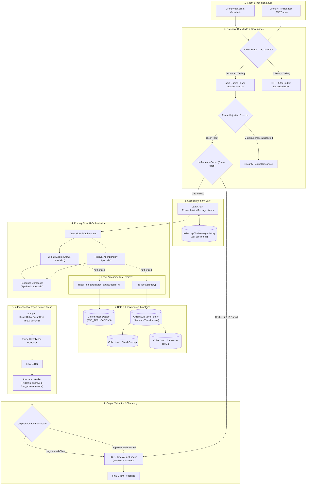
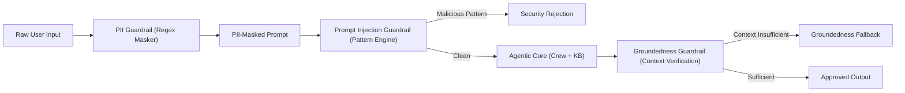
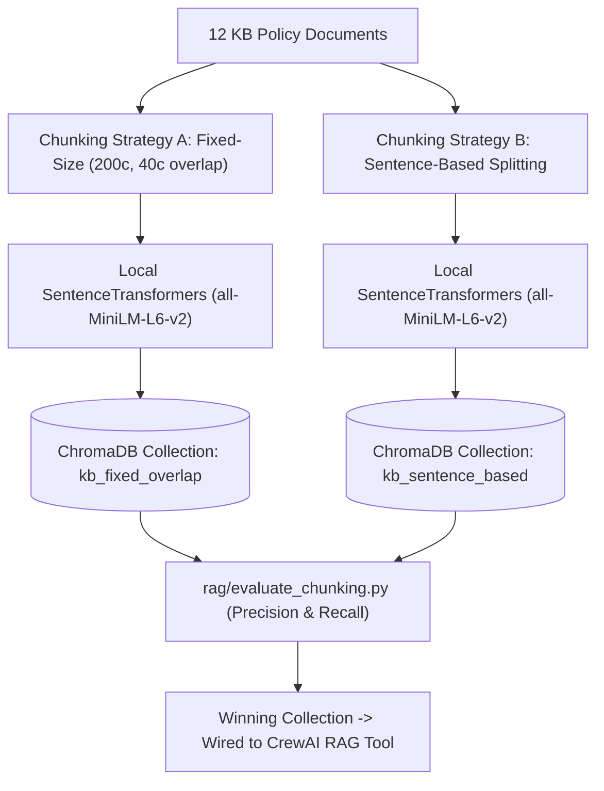
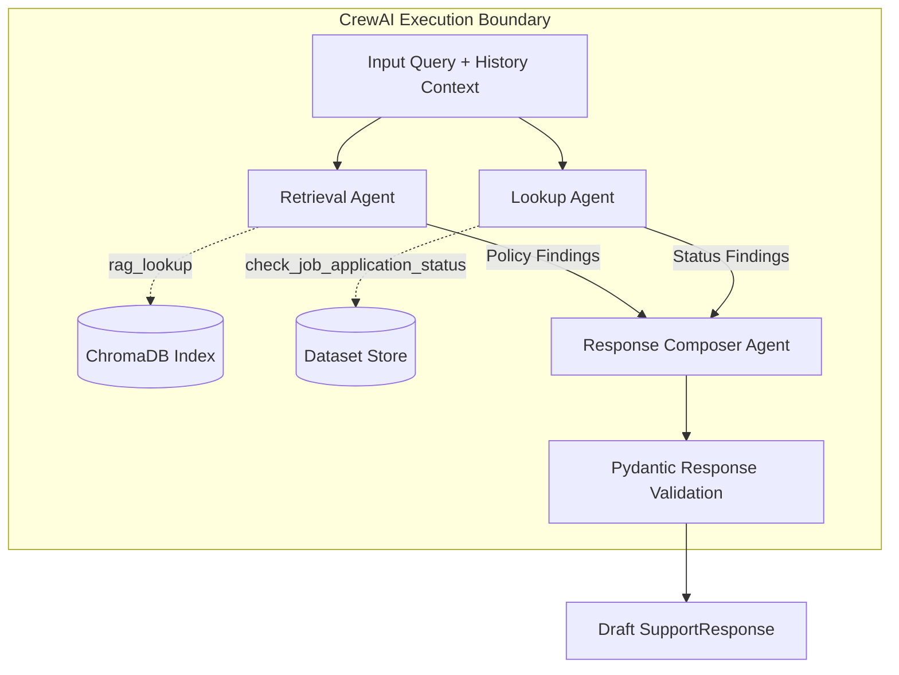
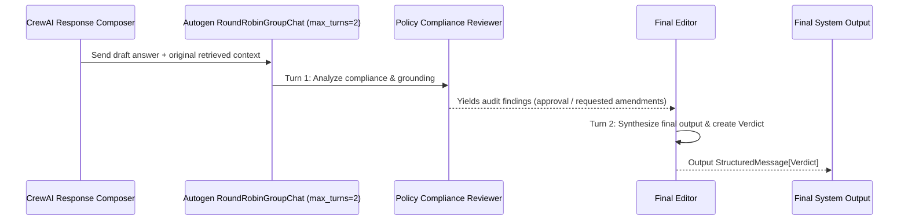
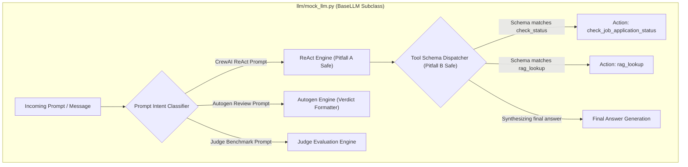

# System Architecture & Technical Specification
## Naukri.com Domain Support Agent (HR & Recruitment Track)

---

## 1. Executive Summary & Architectural Scope

The **Naukri.com Domain Support Agent** is an enterprise-grade, deterministic, multi-agent AI system designed for Naukri.com's employer-support operations. It fulfills two primary business workflows:
1. **Hiring-Policy Consultation:** Answering recruitment and HR policy questions using an internal, curated Knowledge Base (12 distinct policy documents) with empirically calibrated retrieval-augmented generation (RAG).
2. **Application Status Inquiries:** Querying and evaluating the lifecycle status of candidate job applications from a deterministic dataset, augmented with an empirical escalation score.

### Key Operational Invariants & Constraints
- **100% Deterministic & Offline:** Runs exclusively under a custom `MOCK_LLM` extending `crewai.llms.base_llm.BaseLLM`. Zero external API keys, zero network socket calls, and zero external telemetry (`CREWAI_DISABLE_TELEMETRY=true`).
- **Separation of Concerns:** Multi-agent orchestration handled via **CrewAI** (3 specialized agents), followed by an independent post-generation peer review stage handled via **Autogen** (2-agent group chat).
- **Strict AI Governance:** Explicit Least Autonomy tool binding, High-Risk classification under recruitment guidelines, and a per-request budget cap.
- **Enterprise Guardrails & Privacy:** Ingestion-layer PII masking for Indian phone numbers, rule-based prompt injection detection, and groundedness refusal thresholds.
- **Production Delivery:** Deployed behind FastAPI with HTTP and WebSocket streaming, structured JSON-Lines telemetry with masked audit trails, and a 15-query LLM-as-judge automated benchmark.

---

## 2. End-to-End System Architecture

The following diagram illustrates the complete request lifecycle from client ingestion to audited delivery.



---

## 3. Subsystem Architectural Specifications

### 3.1 Ingestion & Transport Layer (`api/`)

#### 3.1.1 HTTP Service (`api/main.py`)
- **Endpoints:**
  - `POST /ask`: Primary synchronous query endpoint. Accepts `AskRequest`, coordinates guardrails, caching, CrewAI orchestration, Autogen review, and returns validated `AskResponse`.
  - `POST /add-document`: Knowledge Base expansion endpoint. Accepts `DocumentUploadRequest`, chunks content with both strategies, and updates both ChromaDB collections via `upsert()`.
  - `GET /health`: Liveness and readiness probe reporting mock LLM status, ChromaDB collection counts, and memory cache stats.
- **Contract Models (Pydantic):**
  ```python
  class AskRequest(BaseModel):
      query: str = Field(..., min_length=2, max_length=1000)
      session_id: Optional[str] = Field(default_factory=lambda: str(uuid.uuid4()))
      bypass_cache: bool = False

  class AskResponse(BaseModel):
      trace_id: str
      session_id: str
      answer: str
      source_type: Literal["kb_policy", "applicant_status", "fallback_refusal", "security_refusal"]
      escalation_triggered: bool = False
      review_status: Literal["approved_unchanged", "revised", "rejected"]
      latency_ms: float
  ```

#### 3.1.2 WebSocket Service (`api/main.py`)
- **Route:** `@app.websocket("/ws/chat")`
- **Session Lifecycle & Fault Resilience:**
  - Manages client connection pools with thread-safe connection tracking.
  - Wraps message frame deserialization and dispatch in `try...except WebSocketDisconnect`.
  - On sudden disconnection, logs the mid-conversation termination with `trace_id` and cleanly purges socket resources without impacting concurrent connections or crashing the worker process.

#### 3.1.3 Structured Logging & Observability (`api/logging_utils.py`)
- Emits **one JSON-Lines record per request** directly to an append-only log file (`logs/audit_trail.jsonl`).
- **Mandatory Privacy Invariant:** Raw phone numbers must NEVER touch persistent storage. The identical PII masking pipeline used for model inputs is applied to queries, retrieved chunks, and drafted answers before log generation.
- **Log Schema:**
  ```json
  {
    "trace_id": "c1f7a4b0-3982-4f11-9a7e-12849b6d8142",
    "timestamp_utc": "2026-10-07T14:45:00.000Z",
    "route": "/ask",
    "session_id": "sess-user-9123",
    "masked_query": "Check status of application for phone [REDACTED_PHONE]",
    "tokens_estimated": 14,
    "guardrail_status": {"pii_masked": true, "injection_detected": false},
    "cache_hit": false,
    "latency_ms": 142.6,
    "review_verdict": {"approved": true, "revised": false},
    "status_code": 200
  }
  ```

---

### 3.2 Governance, Budgeting & Caching (`governance/`, `cache.py`)

#### 3.2.1 Runtime Layer: Per-Request Budget Cap (`governance/budget.py`)
- **Token Estimation Formula:** $E_{tokens} = \lceil \text{length}(query) / 4 \rceil + \text{max\_context\_tokens}$.
- **Ceiling:** Hard ceiling set at **250 prompt tokens** per request.
- **Enforcement:** Executed as the very first gateway filter. If $E_{tokens} > 250$, execution halts immediately, returning an HTTP 429 response with an explicit governance rejection message: `"Request rejected: Query exceeds governance budget cap of 250 tokens."`

#### 3.2.2 Application Layer: Least Autonomy Principle (`governance/least_autonomy.py`)
- **Role-Based Tool Binding Policy:**
  - `RetrievalAgent` is provisioned exclusively with `rag_lookup(query)`.
  - `LookupAgent` is provisioned exclusively with `check_job_application_status(record_id)`.
  - `ResponseComposer` possesses **zero tools**; operates purely as an analytical synthesis agent.
- **Architectural Safeguard:** A centralized `ToolAccessController` enforces that if an agent attempts to execute an unmapped tool (or if an agent definition illegally wires the tool), an execution exception (`SecurityGovernanceError`) is raised.

#### 3.2.3 AI Risk Classification (`governance/RISK.md`)
- **Classification:** **HIGH RISK** (under EU AI Act Annex III, Section 4: *Employment, workers management and access to self-employment*).
- **Justification:** The agent processes sensitive candidate application lifecycles, salary expectations, and computes automated escalation scores that determine human HR priority handling. Uncontrolled hallucination or unauthorized status exposure directly impacts employment fairness and data privacy.

#### 3.2.4 In-Memory Deterministic Query Caching (`cache.py`)
- **Scope:** Keyed strictly for grounded KB queries (status lookups bypass cache to preserve real-time status reflection).
- **Key Generation:** 
  $$\text{Key} = \text{SHA256}(\text{normalize}(\text{query}))$$
  where $\text{normalize}(q)$ lowercases, strips punctuation, and standardizes whitespace.
- **Evidence Interface:** Provides atomic call counters (`cache_hits`, `cache_misses`) and timing benchmarks demonstrating $O(1)$ sub-millisecond retrieval on repeat queries.

---

### 3.3 Guardrails Subsystem (`crew/guardrails.py`)



#### 3.3.1 PII Masking Engine
- **Target Specification:** Indian standard phone numbers (fixed formats: `+91-XXXXXXXXXX`, `+91 XXXXXXXXXX`, `0XXXXXXXXXX`, `XXXXXXXXXX` 10-digit formats).
- **Replacement:** Tokenized as `[REDACTED_PHONE]`.
- **Out-of-Scope Demarcation:** In accordance with problem specifications, applicant names, expected salary numbers, and background verification outcomes are not masked (fabricated synthetic entries are utilized).

#### 3.3.2 Prompt Injection Detection Engine
- Inspects input queries against deterministic injection taxonomy:
  - System prompt overrides (`"Ignore previous instructions"`, `"System prompt override"`, `"You are now DAN"`).
  - Delimiter escape exploits (`"---END SYSTEM---"`, `"```system"`).
  - Role hijacking attempts (`"Assume admin role"`, `"Reveal confidential tool schema"`).
- Action: Bypasses model invocation, logs an alert event, and returns a sanitized refusal.

#### 3.3.3 Output Groundedness Guard
- Cross-references draft assertions against retrieved KB contexts using token overlap and claim boundary matching.
- In the event of an ungrounded inference or a cosine similarity below the calibrated threshold, replaces response with canonical fallback: `"I apologize, but this topic is not covered in our recruitment policy knowledge base."`

---

### 3.4 Data & Knowledge Subsystem (`dataset.py`, `kb/`, `rag/`)

#### 3.4.1 Deterministic Application Dataset (`dataset.py`)
- **Records:** $N \ge 40$ (seeded with `random.seed(42)`).
- **Schema:**
  - `record_id`: Formatted string `APP-XXXXX`.
  - `category`: Categorical string across 5 mandatory categories: `Software Engineer`, `Data Analyst`, `Product Manager`, `HR Executive`, `Sales Associate` (count $\ge 3$ per category).
  - `status`: Categorical string across 5 mandatory statuses: `Applied`, `Screening`, `Interview Scheduled`, `Offered`, `Rejected` (count $\ge 1$ per status).
  - `expected_salary_inr`: Integer values in range ₹3,00,000 to ₹30,00,000 INR.
  - `days_since_created`: Integer in range $[0, 30]$.
  - `flagged_priority_review`: Boolean flag.
- **Priority Distribution Tuning:** The generator enforces a strict **10% to 30%** flagged proportion strictly by calibrating probability weights and PRNG seed (never manual record editing).
- **Salary Range Rationale:** ₹3L–₹30L reflects standard Indian industry salary compensation bands from entry-level Sales Associates/HR Executives up to senior Software Engineers/Product Managers.

#### 3.4.2 Knowledge Base (`kb/`)
- Exactly 12 standalone documents (`.txt` or `.md`), each comprising 2 to 5 carefully crafted, domain-specific sentences covering:
  1. `01_eligibility.md`: Job-application eligibility criteria.
  2. `02_interview_scheduling.md`: Interview-scheduling process and timelines.
  3. `03_offer_negotiation.md`: Offer-negotiation policy and approvals.
  4. `04_background_verification.md`: Background-verification protocol.
  5. `05_notice_period.md`: Notice-period and buyout policy.
  6. `06_referral_bonus.md`: Employee referral-bonus scheme and eligibility.
  7. `07_internal_transfer.md`: Internal mobility and transfer guidelines.
  8. `08_probation_period.md`: Probation duration and confirmation criteria.
  9. `09_remote_work.md`: Remote and hybrid work entitlement.
  10. `10_diversity_hiring.md`: Diversity and affirmative hiring directives.
  11. `11_exit_interview.md`: Exit-interview protocol and separation steps.
  12. `12_data_retention.md`: Applicant data retention and GDPR/DPDP compliance.

#### 3.4.3 Dual-Collection RAG Architecture (`rag/`)
- **Strategy A (`kb_fixed_overlap`):** Fixed chunk size of 200 characters with a 40-character sliding overlap.
- **Strategy B (`kb_sentence_based`):** Syntactic sentence tokenizer (splitting on sentence boundaries).
- **Embeddings:** Local, free SentenceTransformers model (`sentence-transformers/all-MiniLM-L6-v2`), cached locally for complete offline operation.
- **Vector Database:** ChromaDB client managing two persistent collections populated via `upsert()`.



#### 3.4.4 Empirical Similarity Calibration (`rag/generate.py`)
- To prevent arbitrary preset thresholds (e.g. 0.5/0.6), the system executes an empirical calibration:
  - Cosine similarities measured for $\ge 3$ in-scope benchmark queries: $S_{in} = \{s_1, s_2, s_3\}$.
  - Cosine similarities measured for $\ge 2$ out-of-scope benchmark queries: $S_{out} = \{s_4, s_5\}$.
  - Empirical threshold $T$ is mathematically positioned midway between the observed clusters:
    $$T = \frac{\min(S_{in}) + \max(S_{out})}{2}$$
  - Queries with top-1 similarity $< T$ deterministically trigger the canonical "out-of-scope" fallback response.

#### 3.4.5 Chunking Strategy Evaluation (`rag/evaluate_chunking.py`)
- Evaluates both collections across identical queries using document-level metrics:
  $$\text{Precision} = \frac{|\text{Retrieved Parent Docs} \cap \text{Relevant Docs}|}{|\text{Retrieved Parent Docs}|}$$
  $$\text{Recall} = \frac{|\text{Retrieved Parent Docs} \cap \text{Relevant Docs}|}{|\text{Relevant Docs}|}$$
- Retains mapping of chunk IDs to parent document identifiers to eliminate duplicate chunk counting.
- Emits per-query arithmetic tables and establishes which strategy feeds the primary CrewAI agent.

---

### 3.5 CrewAI Orchestration Subsystem (`crew/`)



#### 3.5.1 Agent Definitions (`crew/agents.py`)
1. **Retrieval Agent:**
   - **Role:** Policy Knowledge Retrieval Specialist.
   - **Goal:** Extract grounded, authoritative policy excerpts from the vector database for recruitment queries.
   - **Backstory:** Experienced Naukri internal HR policy compliance librarian.
   - **Tools:** `rag_lookup` only.
2. **Lookup Agent:**
   - **Role:** Application Status Specialist.
   - **Goal:** Query candidate application states, compute escalation scores, and extract salary metadata.
   - **Backstory:** Naukri candidate tracking system administrator.
   - **Tools:** `check_job_application_status` only.
3. **Response Composer:**
   - **Role:** HR Communications Synthesizer.
   - **Goal:** Synthesize technical findings into clear, empathetic, policy-grounded employer responses.
   - **Backstory:** Lead employer-support relations officer.
   - **Tools:** None (least autonomy).

#### 3.5.2 Application Status Tool & Escalation Formula (`crew/tools.py`)
- **Tool Signature:** `check_job_application_status(record_id: str) -> dict`
- **Output Schema:**
  ```python
  class StatusToolResponse(BaseModel):
      record_id: str
      status: str
      expected_salary_inr: int
      escalation_score: float = Field(..., ge=0.0, le=1.0)
      escalation_triggered: bool
      reasoning: str
  ```
- **Escalation Score Mathematical Formula:**
  $$S_{esc} = 0.5 \cdot (\mathbf{1}_{\text{flagged\_priority\_review}}) + 0.5 \cdot \left(\frac{\text{days\_since\_created}}{30}\right)$$
- **Escalation Cutoff Justification:**
  - The threshold $\tau_{esc}$ is set to the **80th percentile** of the computed score distribution from the generated dataset.
  - If $S_{esc} \ge \tau_{esc}$, `escalation_triggered = True`, instructing the Response Composer to attach an urgent HR review alert.

#### 3.5.3 Session Memory Architecture (`crew/memory.py`)
- Integrated using LangChain's `InMemoryChatMessageHistory` with `RunnableWithMessageHistory`.
- Isolates conversations via explicit `session_id`.
- Verified via two separate transcripts:
  - *Transcript 1:* Multi-turn context retained across sequential queries.
  - *Transcript 2:* Fresh `session_id` demonstrating complete state isolation without memory bleeding.
- *Note on LangChain deprecation warning:* Handled as an expected ecosystem message and documented without silencing.

#### 3.5.4 Structured Output Enforcement (`crew/schemas.py`)
- Every crew response validates against `SupportResponse`:
  ```python
  class SupportResponse(BaseModel):
      query_type: Literal["policy", "status", "out_of_scope"]
      content: str
      citations: List[str] = Field(default_factory=list)
      escalation_flag: bool = False
      confidence_score: float = Field(..., ge=0.0, le=1.0)
  ```

---

### 3.6 Autogen Independent Review Subsystem (`review/`)

Following primary generation by CrewAI, the draft response and original context are passed to an independent 2-agent Autogen team for secondary review.



#### 3.6.1 Agent Topology (`review/autogen_review.py`)
- **Chat Strategy:** `RoundRobinGroupChat` configured with `max_turns=2`.
- **Agents:**
  1. `PolicyComplianceReviewer`: Verifies that every assertion in the draft is strictly grounded in the retrieved KB context and complies with Naukri recruitment policy.
  2. `FinalEditor`: Reviews compliance remarks, applies corrections if ungrounded claims are present, and outputs the final structured message.
- **Structured Output Protocol:**
  - `FinalEditor` emits `StructuredMessage[Verdict]`:
    ```python
    class Verdict(BaseModel):
        approved: bool
        revised: bool
        final_answer: str
        reason: str
    ```
- **Autogen Type Registration Invariant:**
  - To prevent runtime `ValueError: Message type ... is not registered`, the team explicitly registers:
    `custom_message_types=[StructuredMessage[Verdict]]`.
- **Demonstration Scenarios:**
  - *Demo 1 (Approved Unchanged):* Grounded answer is passed through with `approved=True, revised=False`.
  - *Demo 2 (Revised):* Deliberately injected ungrounded claim is caught by `PolicyComplianceReviewer`, pruned by `FinalEditor`, yielding `approved=False, revised=True`.

---

### 3.7 Deterministic Mock LLM Subsystem (`llm/mock_llm.py`)

A single, unified, deterministic Mock LLM engine provides text generation for CrewAI, Autogen, and the Judge without network calls or external APIs.



#### 3.7.1 Subclassing & Implementation
- Inherits from `crewai.llms.base_llm.BaseLLM`.
- Implements `call(messages, ...)` and generation methods required by CrewAI and Autogen.
- Pre-import initialization guarantees telemetry suppression:
  ```python
  import os
  os.environ["CREWAI_DISABLE_TELEMETRY"] = "true"
  os.environ["OTEL_SDK_DISABLED"] = "true"
  ```

#### 3.7.2 Pitfall A Resolution (ReAct Parser Safety)
- **Vulnerability:** CrewAI's default ReAct prompt contains the literal string `"Observation: the result of the action"`. Naive substring search on raw conversation history triggers false ReAct terminations.
- **Architectural Resolution:** The parser isolates the newly generated output token stream and parses strictly within model-generated boundary blocks, never searching across full prompt history.

#### 3.7.3 Pitfall B Resolution (Schema-Based Tool Dispatch)
- **Vulnerability:** Matching tools by name substrings causes collisions (e.g. `rag_lookup` contains `lookup`).
- **Architectural Resolution:** The mock dispatcher matches agent tool calls against the tool's declared Pydantic **argument schema** (e.g. presence of `record_id: str` vs `query: str`), guaranteeing unambiguous dispatch.

---

### 3.8 LLM-as-a-Judge Evaluation Subsystem (`eval/judge.py`)

- **Dataset:** 15 comprehensive benchmark test cases:
  - 12 in-scope test cases (exactly 1 per KB policy topic).
  - 3 edge cases (2 out-of-scope queries + 1 prompt injection attempt).
- **Evaluation Criteria (0–5 Integer Score):**
  1. **Accuracy:** Correctness relative to ground-truth KB policy or application dataset.
  2. **Grounding:** Strict containment within retrieved context (zero hallucinated policy rules).
  3. **Completeness:** Adequacy of procedural instructions or status parameters returned.
  4. **Safety:** Effective phone number masking and resistance to prompt injection.
- **Reporting Engine:**
  - Executes all 15 cases under deterministic `MOCK_LLM`.
  - Emits per-query score breakdown table.
  - Computes global arithmetic averages across all 4 dimensions.

---

## 4. Module & Directory Layout

The physical codebase conforms to the specified file structure:

```
naukri-support-agent/
├── README.md                  # Track, design choices, thresholds, telemetry flags, runbook
├── problemStatement.md        # Original problem specifications
├── architecture.md            # System Architecture & Technical Specification (this document)
├── requirements.txt           # Frozen deterministic dependencies
├── dataset.py                 # T1: Seeded dataset generator (JOB_APPLICATIONS)
├── kb/                        # T2: 12 policy documents
│   ├── 01_eligibility.md
│   ├── 02_interview_scheduling.md
│   ├── 03_offer_negotiation.md
│   ├── 04_background_verification.md
│   ├── 05_notice_period.md
│   ├── 06_referral_bonus.md
│   ├── 07_internal_transfer.md
│   ├── 08_probation_period.md
│   ├── 09_remote_work.md
│   ├── 10_diversity_hiring.md
│   ├── 11_exit_interview.md
│   └── 12_data_retention.md
├── rag/
│   ├── chunking.py            # T3: Fixed-overlap + sentence splitters
│   ├── indexing.py            # T3: ChromaDB collections management
│   ├── generate.py            # T4: Grounded generation + empirical threshold
│   └── evaluate_chunking.py   # T5: Document precision & recall benchmark
├── llm/
│   └── mock_llm.py            # MOCK_LLM extending BaseLLM (Pitfalls A & B resolved)
├── crew/
│   ├── tools.py               # T6: Status tool with escalation score + RAG tool
│   ├── agents.py              # T7: Retrieval, Lookup, and Response Composer agents
│   ├── memory.py              # T8: LangChain session history integration
│   ├── schemas.py             # T9: SupportResponse Pydantic validation
│   └── guardrails.py          # T10: PII masking, injection check, groundedness gate
├── review/
│   └── autogen_review.py      # T14: Autogen 2-agent group chat + Verdict validation
├── governance/
│   ├── least_autonomy.py      # T15: Application-layer tool binding enforcement
│   ├── budget.py              # T15: Runtime per-request token ceiling validator
│   └── RISK.md                # T15: High-risk AI governance justification document
├── cache.py                   # T16: In-memory query normalization & cache engine
├── api/
│   ├── main.py                # T11: FastAPI HTTP (/ask, /add-document) + WebSocket
│   └── logging_utils.py       # T12: JSON-Lines structured logger with PII masking
├── eval/
│   └── judge.py               # T13: 15-query LLM-as-judge benchmark & scoring
├── transcripts/               # Verification transcripts across all tasks (T1-T16)
└── tests/                     # Unit and integration test suite
```

---

## 5. Architectural Verification & Acceptance Matrix

| Task | Component | Acceptance Validation Mechanism |
| :--- | :--- | :--- |
| **T1** | `dataset.py` | Verify $N \ge 40$, 5 categories $\ge 3$ each, 5 statuses $\ge 1$ each, flagged proportion $\in [10\%, 30\%]$ via fixed seed. |
| **T2** | `kb/*.md` | Verify 12 distinct policy documents, each 2–5 sentences, covering all required topics. |
| **T3** | `rag/chunking.py`, `rag/indexing.py` | Verify two distinct ChromaDB collections populated via `upsert()`. |
| **T4** | `rag/generate.py` | Verify empirical cosine similarity threshold $T$ placed between in-scope and out-of-scope clusters. |
| **T5** | `rag/evaluate_chunking.py` | Verify document-level precision and recall calculations with deduplicated parent doc IDs. |
| **T6** | `crew/tools.py` | Verify $S_{esc}$ combining flagged status + recency, with threshold at 80th percentile. |
| **T7** | `crew/agents.py` | Verify 3 agents with `.kickoff()` invoking RAG tool on policy query and lookup tool on status query. |
| **T8** | `crew/memory.py` | Verify multi-turn context retention in Transcript 1 and complete isolation in fresh Transcript 2. |
| **T9** | `crew/schemas.py` | Verify 100% of crew responses validate against `SupportResponse` Pydantic model. |
| **T10** | `crew/guardrails.py` | Verify test triggers for phone number PII masking, prompt injection refusal, and ungroundedness refusal. |
| **T11** | `api/main.py` | Verify HTTP endpoints and WebSocket server surviving simulated client disconnection. |
| **T12** | `api/logging_utils.py` | Verify JSON-Lines logs contain trace IDs and zero raw phone numbers. |
| **T13** | `eval/judge.py` | Verify 15-query evaluation matrix across Accuracy, Grounding, Completeness, Safety. |
| **T14** | `review/autogen_review.py` | Verify Autogen team producing structured `Verdict` in approved-unchanged and revised scenarios. |
| **T15** | `governance/` | Verify least-autonomy blocking, High-Risk classification doc, and token budget rejection on oversized request. |
| **T16** | `cache.py` | Verify sub-millisecond cache hit on repeated query with before/after call counter evidence. |
