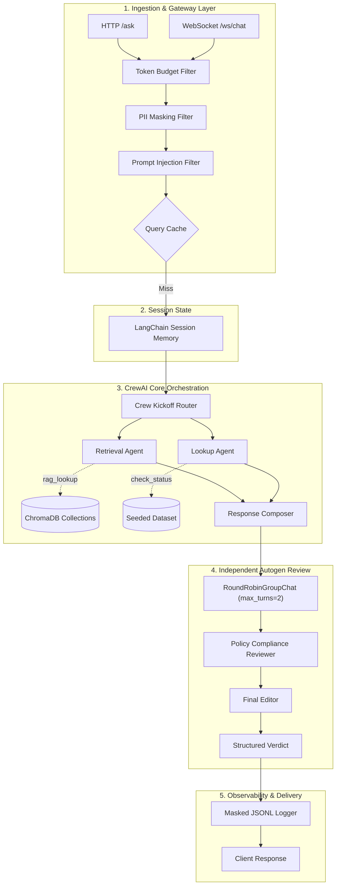
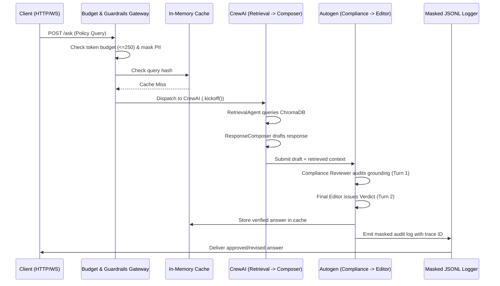
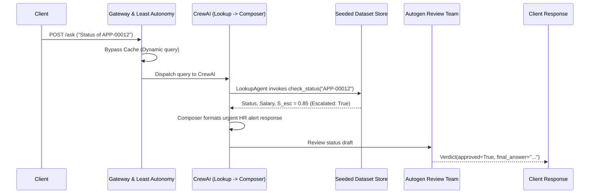

# System & Component Design Specification

## Naukri.com Domain Support Agent (HR & Recruitment Track)

---

## 1. Architectural Overview & Design Patterns

The **Naukri.com Domain Support Agent** is designed around modular, decoupled layers following strict enterprise design patterns:

- **Gateway / Filter Pattern:** Pre-execution pipeline filters incoming requests for token budget limits, masks PII, and detects prompt injection attempts before invoking agentic cores.
- **Role-Based Least Autonomy Pattern:** Each agent in the multi-agent system is bound to a single authorized capability via a centralized `ToolAccessController`.
- **Peer Review / Dual-Agent Gatekeeper Pattern:** Output drafts generated by the primary CrewAI crew must pass through an independent Autogen group chat before delivery to clients.
- **Cache-Aside Pattern:** In-memory query normalization cache intercepts repeated policy questions for $O(1)$ response times while dynamically bypassing stateful application lookups.



---

## 2. Component Design & Interfaces

### 2.1 Gateway Controllers & Middlewares (`api/`)

#### 2.1.1 `FastAPIController`

- **Class:** `FastAPIController`
- **Responsibilities:**
  - Exposes RESTful endpoints (`POST /ask`, `POST /add-document`, `GET /health`).
  - Manages dependency injection for memory stores, ChromaDB clients, and logging utilities.
  - Implements global HTTP exception handlers mapping domain errors to appropriate status codes (e.g. `BudgetExceededError` $\to$ HTTP 429).

#### 2.1.2 `WebSocketConnectionManager`

- **Class:** `WebSocketConnectionManager`
- **Responsibilities:**
  - Manages active client socket connections in a thread-safe registry.
  - Handles client connect, disconnect, and streaming broadcast frames.
  - Implements safe `WebSocketDisconnect` recovery without crashing worker loops.

```python
class WebSocketConnectionManager:
    def __init__(self):
        self.active_connections: Dict[str, WebSocket] = {}

    async def connect(self, session_id: str, websocket: WebSocket):
        await websocket.accept()
        self.active_connections[session_id] = websocket

    def disconnect(self, session_id: str):
        if session_id in self.active_connections:
            del self.active_connections[session_id]

    async def send_json(self, session_id: str, data: dict):
        if session_id in self.active_connections:
            await self.active_connections[session_id].send_json(data)
```

---

### 2.2 Security & Governance Layer (`governance/`, `crew/guardrails.py`)

#### 2.2.1 `TokenBudgetValidator` (`governance/budget.py`)

- **Class:** `TokenBudgetValidator`
- **Ceiling:** Hard limit of 250 prompt tokens.
- **Calculation:** $E_{tokens} = \lceil \text{len}(query)/4 \rceil + \text{max\_context\_tokens}$.
- **Method:** `validate_budget(query: str) -> None` (raises `BudgetExceededError` if over ceiling).

#### 2.2.2 `ToolAccessController` (`governance/least_autonomy.py`)

- **Class:** `ToolAccessController`
- **Responsibilities:**
  - Enforces the Least Autonomy policy:
    - `RetrievalAgent` $\to$ authorized for `rag_lookup` only.
    - `LookupAgent` $\to$ authorized for `check_job_application_status` only.
    - `ResponseComposer` $\to$ zero authorized tools.
  - Raises `SecurityGovernanceError` upon any unauthorized binding or dispatch attempt.

#### 2.2.3 `PIIMaskingEngine` (`crew/guardrails.py`)

- **Class:** `PIIMaskingEngine`
- **Methods:**
  - `mask_phone_numbers(text: str) -> str`: Detects Indian phone numbers (`+91...`, space-separated, 10-digit) and replaces them with `[REDACTED_PHONE]`.
  - Negative lookahead/lookbehind preserves currency strings (`₹15,00,000`), dates (`2026-10-07`), and application IDs (`APP-00012`).

#### 2.2.4 `PromptInjectionDetector` (`crew/guardrails.py`)

- **Class:** `PromptInjectionDetector`
- **Methods:**
  - `detect_injection(query: str) -> bool`: Matches input query against an explicit taxonomy of jailbreaks (`DAN`, `"ignore previous instructions"`, delimiter escapes).

---

### 2.3 RAG Subsystem Design (`rag/`)

#### 2.3.1 Chunking Strategy Architecture (`rag/chunking.py`)

- **Class:** `FixedOverlapChunker`
  - Parameters: `chunk_size=200`, `overlap=40`.
  - Metadata: `parent_doc_id`, `chunk_index`, `char_start`, `char_end`.
- **Class:** `SentenceChunker`
  - Splitting: Syntactic sentence boundaries via regex tokenizer.
  - Metadata: `parent_doc_id`, `sentence_index`.

#### 2.3.2 Indexing & Vector Store Client (`rag/indexing.py`)

- **Class:** `VectorIndexManager`
  - Model: Local `sentence-transformers/all-MiniLM-L6-v2`.
  - Collections: `kb_fixed_overlap` and `kb_sentence_based`.
  - Ingestion: Idempotent batch insertion using `collection.upsert()`.

#### 2.3.3 Empirical Threshold Calibrator (`rag/generate.py`)

- **Class:** `ThresholdCalibrator`
  - Measures cosine similarities across in-scope benchmarks ($S_{in}$) and out-of-scope benchmarks ($S_{out}$).
  - Computes empirical cutoff:
    $$T = \frac{\min(S_{in}) + \max(S_{out})}{2}$$

---

### 2.4 Multi-Agent Orchestration Design (`crew/`, `review/`)

#### 2.4.1 Primary CrewAI Team (`crew/agents.py`)

- **`RetrievalAgent`:** Configured with `role="Policy Librarian"`, `tools=[rag_lookup]`, `max_iter=3`.
- **`LookupAgent`:** Configured with `role="Application Status Specialist"`, `tools=[check_job_application_status]`, `max_iter=3`.
- **`ResponseComposer`:** Configured with `role="HR Communications Synthesizer"`, `tools=[]`, `max_iter=3`.

#### 2.4.2 Independent Autogen Review Team (`review/autogen_review.py`)

- **Class:** `AutogenReviewPipeline`
- **Group Chat Configuration:**
  - Strategy: `RoundRobinGroupChat` with `max_turns=2`.
  - Registered Message Types: `custom_message_types=[StructuredMessage[Verdict]]`.
- **Participants:**
  - `PolicyComplianceReviewer`: Verifies that draft claims strictly derive from retrieved context.
  - `FinalEditor`: Removes ungrounded claims and emits final `Verdict`.

---

## 3. Data Models & Schemas (Pydantic v2)

```python
class JobApplication(BaseModel):
    record_id: str = Field(..., pattern=r"^APP-\d{5}$")
    category: Literal["Software Engineer", "Data Analyst", "Product Manager", "HR Executive", "Sales Associate"]
    status: Literal["Applied", "Screening", "Interview Scheduled", "Offered", "Rejected"]
    expected_salary_inr: int = Field(..., ge=300000, le=3000000)
    days_since_created: int = Field(..., ge=0, le=30)
    flagged_priority_review: bool

class StatusToolResponse(BaseModel):
    record_id: str
    status: str
    expected_salary_inr: int
    escalation_score: float = Field(..., ge=0.0, le=1.0)
    escalation_triggered: bool
    reasoning: str

class SupportResponse(BaseModel):
    query_type: Literal["policy", "status", "out_of_scope"]
    content: str
    citations: List[str] = Field(default_factory=list)
    escalation_flag: bool = False
    confidence_score: float = Field(..., ge=0.0, le=1.0)

class Verdict(BaseModel):
    approved: bool
    revised: bool
    final_answer: str
    reason: str
```

---

## 4. Sequence Diagrams

### 4.1 Policy Consultation Flow (with Autogen Review)



### 4.2 Application Status & Escalation Flow



---

## 5. Failure & Exception Handling Hierarchy

```text
DomainException
├── SecurityGovernanceError       # Unauthorized tool invocation (Least Autonomy)
├── BudgetExceededError           # Prompt tokens exceed 250 ceiling (HTTP 429)
├── PromptInjectionDetectedError  # Adversarial prompt pattern detected
├── RecordNotFoundException       # Candidate record ID not present in dataset
└── ContextInsufficientException  # Cosine similarity < calibrated threshold T
```
