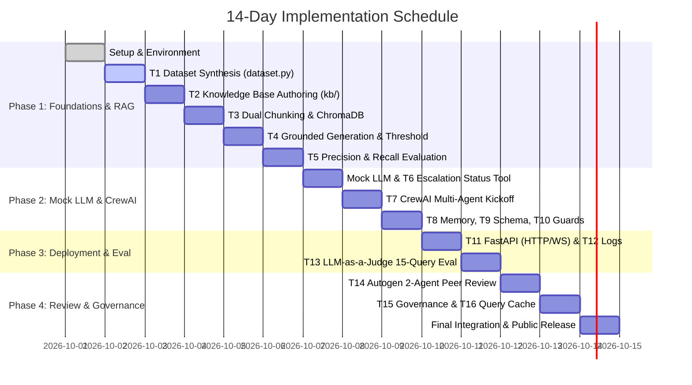

# Implementation Plan & Execution Roadmap

## Naukri.com Domain Support Agent (HR & Recruitment Track)

---

## 1. Plan Overview & Engineering Philosophy

This implementation plan translates the architectural specifications in [`doc/architecture.md`](file:///c:/Users/kastu/Desktop/capstone%20-%20hr/doc/architecture.md) and requirements in [`doc/problemStatement.md`](file:///c:/Users/kastu/Desktop/capstone%20-%20hr/doc/problemStatement.md) into a day-by-day, phase-by-phase execution roadmap.

### Core Implementation Principles

1. **Deterministic Execution First:** Implement the `MOCK_LLM` engine and telemetry flags before wiring agents to eliminate flaky runs, external network dependencies, or API rate limits.
2. **Mathematical Rigor & Empirical Evidence:** No hardcoded heuristic assumptions. Thresholds for RAG cosine similarity (T4) and application escalation (T6) are derived empirically from generated distributions.
3. **Defense-in-Depth Governance:** Enforce Least Autonomy at the Python class/binding level, pre-execution prompt budgeting at the gateway, and input/output guardrails before and after model invocation.
4. **Clean Verification Transcripts:** Every task yields a deterministic verification artifact or transcript saved in `transcripts/` to satisfy all rubric acceptance criteria.
5. **Strict File Placement:** All documentation files (`.md`) reside strictly inside the [`doc/`](file:///c:/Users/kastu/Desktop/capstone%20-%20hr/doc) directory.

---

## 2. 14-Day Phase Schedule & Milestone Matrix



| Phase | Days | Target Mark Weight | Key Deliverables |
| :--- | :---: | :---: | :--- |
| **Phase 1: Dataset & RAG Core** | Days 1–6 | 30 Marks | `dataset.py`, `kb/*.md`, `rag/chunking.py`, `rag/indexing.py`, `rag/generate.py`, `rag/evaluate_chunking.py` |
| **Phase 2: CrewAI, Memory & Guardrails** | Days 7–9 | 30 Marks | `llm/mock_llm.py`, `crew/tools.py`, `crew/agents.py`, `crew/memory.py`, `crew/schemas.py`, `crew/guardrails.py` |
| **Phase 3: Observability, Eval & API** | Days 10–11 | 20 Marks | `api/main.py`, `api/logging_utils.py`, `eval/judge.py`, WebSocket resilient connection test |
| **Phase 4: Review, Governance & Cache** | Days 12–14 | 20 Marks | `review/autogen_review.py`, `governance/least_autonomy.py`, `governance/budget.py`, `governance/RISK.md`, `cache.py` |

---

## 3. Phase 1 — Dataset Design & RAG Core (Days 1–6)

### Day 1: Environment Baseline & Repository Scaffolding

- **Objective:** Finalize workspace structure, directory tree, and environment sanity checks.
- **Tasks:**
  1. Confirm dependencies in `.hr` environment (`pip check`).
  2. Create modular project folders: `kb/`, `rag/`, `llm/`, `crew/`, `review/`, `governance/`, `api/`, `eval/`, `transcripts/`, `tests/`.
  3. Verify `.gitignore` ignores all virtual environments and databases.
- **Verification:** Run `pytest` or folder check command; confirm clean directory layout.

### Day 2: Task T1 — Seeded Deterministic Dataset (`dataset.py`)

- **Objective:** Generate reproducible synthetic applicant database matching Naukri scenario vocabulary.
- **Implementation Specifications:**
  - Seed: `random.seed(42)` and `numpy.random.seed(42)`.
  - Records count: $N = 50$ (satisfies $\ge 40$).
  - Required Categories (each $\ge 3$ records):
    - `Software Engineer`
    - `Data Analyst`
    - `Product Manager`
    - `HR Executive`
    - `Sales Associate`
  - Required Statuses (each $\ge 1$ records):
    - `Applied`, `Screening`, `Interview Scheduled`, `Offered`, `Rejected`
  - Priority Flag (`flagged_priority_review`): Tune generation weights such that flagged proportion lands strictly within **10% to 30%** (e.g. 18% or 20%).
  - Salary Range (`expected_salary_inr`): ₹3,00,000 to ₹30,00,000 INR.
  - Recency (`days_since_created`): Uniform integer $\in [0, 30]$.
- **Deliverables & Verification:**
  - File: `dataset.py`.
  - CLI Output: Run `python dataset.py` to print summary tables (category distribution, status distribution, % flagged, and salary range justification).
  - Transcript: Save output to `transcripts/t1_dataset_summary.txt`.

### Day 3: Task T2 — Curated Knowledge Base Authoring (`kb/`)

- **Objective:** Create 12 distinct, high-quality, domain-specific policy documents in own words (2–5 sentences each).
- **File Manifest:**
  1. `kb/01_eligibility.md`: Minimum educational degrees, career gaps allowance, and role qualification rules.
  2. `kb/02_interview_scheduling.md`: Stages, candidate reschedule policies (max 2 attempts), and 48-hour SLAs.
  3. `kb/03_offer_negotiation.md`: Fixed vs variable pay guidelines, approvals for deviations $>15\%$, and 5-day validity.
  4. `kb/04_background_verification.md`: Third-party vendor BGV process, criminal history checks, and education verification.
  5. `kb/05_notice_period.md`: 30-day to 90-day notice periods, buyout calculations, and early release rules.
  6. `kb/06_referral_bonus.md`: Payout milestones (50% at 3 months, 50% at 6 months), eligibility exclusions.
  7. `kb/07_internal_transfer.md`: Minimum 12 months tenure in current team, good standing rating requirement.
  8. `kb/08_probation_period.md`: 6-month standard probation, mid-term check-in, confirmation or 3-month extension.
  9. `kb/09_remote_work.md`: Hybrid model (3 days office, 2 days remote), approval matrix for 100% remote.
  10. `kb/10_diversity_hiring.md`: Gender diversity affirmative initiatives, veterans program, unconscious bias audits.
  11. `kb/11_exit_interview.md`: Mandatory HR clearance, asset handover protocol, final settlement timeline (45 days).
  12. `kb/12_data_retention.md`: 180-day resume archive rule, GDPR/DPDP deletion on request protocol.
- **Verification:** Script verifying that all 12 files exist, each has 2–5 sentences, and covers the topic thoroughly.

### Day 4: Task T3 — Dual Chunking Strategies & ChromaDB Indexing (`rag/`)

- **Objective:** Implement two different chunking strategies and index into two isolated ChromaDB collections.
- **Implementation Specifications:**
  - `rag/chunking.py`:
    - `FixedOverlapChunker`: 200 characters chunk size with 40 characters overlap.
    - `SentenceChunker`: Syntactic sentence boundary splitting (using regex or NLTK/SpaCy sentence tokenizer).
    - Attach document metadata: `parent_doc_id`, `topic_name`, `chunk_index`.
  - `rag/indexing.py`:
    - Model: Local `sentence-transformers/all-MiniLM-L6-v2`.
    - Chroma Collections: `kb_fixed_overlap` and `kb_sentence_based`.
    - Ingestion: Use `collection.upsert()` for idempotency.
- **Verification:** Run indexing script; query sample string (`"notice period buyout"`) across both collections to confirm retrieval. Save transcript to `transcripts/t3_indexing_sample.txt`.

### Day 5: Task T4 — Grounded Generation & Empirical Threshold Calibration (`rag/generate.py`)

- **Objective:** Calibrate similarity threshold $T$ strictly based on empirical observations and implement grounded answer generation.
- **Calibration Protocol:**
  - Measure cosine similarities for $\ge 3$ in-scope queries (e.g., notice buyout, BGV checks, probation tenure).
  - Measure cosine similarities for $\ge 2$ out-of-scope queries (e.g., company stock dividend policy, office lunch catering).
  - Compute clusters: $\min(S_{in})$ and $\max(S_{out})$.
  - Empirically set cutoff threshold:
    $$T = \frac{\min(S_{in}) + \max(S_{out})}{2}$$
  - Guardrail fallback: If top-1 similarity $< T$, emit canonical fallback: `"I apologize, but this topic is not covered in our recruitment policy knowledge base."`
- **Verification:** Demonstrate $\ge 5$ in-scope answers generated from context + 1 out-of-scope fallback triggering. Save results to `transcripts/t4_grounded_generation_demos.txt`.

### Day 6: Task T5 — Chunking Evaluation (Precision & Recall) (`rag/evaluate_chunking.py`)

- **Objective:** Evaluate document-level precision and recall for both collections using deduplicated parent documents.
- **Evaluation Arithmetic:**
  - Define benchmark test suite of $\ge 5$ diverse policy queries with known ground-truth parent documents.
  - For top-$k$ retrieved chunks, map each chunk to `parent_doc_id` and deduplicate.
  - Compute:
    $$\text{Precision} = \frac{|\text{Retrieved Parent Docs} \cap \text{Relevant Docs}|}{|\text{Retrieved Parent Docs}|}$$
    $$\text{Recall} = \frac{|\text{Retrieved Parent Docs} \cap \text{Relevant Docs}|}{|\text{Relevant Docs}|}$$
  - Print arithmetic step-by-step for both `kb_fixed_overlap` and `kb_sentence_based`.
  - Provide a 2–3 sentence data-driven recommendation selecting the winning collection for CrewAI.
- **Verification:** Run evaluation script; save results and recommendation to `transcripts/t5_chunking_evaluation.txt`.

---

## 4. Phase 2 — Orchestration, Memory & Guardrails (Days 7–9)

### Day 7: Deterministic `MOCK_LLM` & Task T6 Status Tool

- **Objective:** Build the core `MOCK_LLM` engine and the applicant status lookup tool.
- **Sub-task 1: `llm/mock_llm.py`:**
  - Extend `crewai.llms.base_llm.BaseLLM`.
  - **Resolve Pitfall A:** Parse newly generated token blocks; do not perform naive substring search for `"Observation:"`.
  - **Resolve Pitfall B:** Dispatch tool invocations using Pydantic argument schemas (`record_id` vs `query`), not tool name substrings.
  - Disable telemetry at import time:

    ```python
    import os
    os.environ["CREWAI_DISABLE_TELEMETRY"] = "true"
    os.environ["OTEL_SDK_DISABLED"] = "true"
    ```

- **Sub-task 2: `crew/tools.py` (Task T6):**
  - Implement `check_job_application_status(record_id: str) -> dict`.
  - Escalation Formula:
    $$S_{esc} = 0.5 \cdot (\mathbf{1}_{\text{flagged\_priority\_review}}) + 0.5 \cdot \left(\frac{\text{days\_since\_created}}{30}\right)$$
  - Calculate empirical 80th percentile threshold $\tau_{esc}$ from `dataset.py`.
  - Return `record_id`, `status`, `expected_salary_inr`, `escalation_score`, `escalation_triggered` (bool), and `reasoning`.
- **Verification:** Unit test tool on 5 sample record IDs; verify score computation and 80th percentile threshold cutoff. Save output to `transcripts/t6_status_tool_tests.txt`.

### Day 8: Task T7 — CrewAI Multi-Agent Team (`crew/agents.py`)

- **Objective:** Assemble a 3-agent CrewAI crew driven by `MOCK_LLM`.
- **Agent Definitions:**
  1. `RetrievalAgent`: Armed exclusively with `rag_lookup` tool.
  2. `LookupAgent`: Armed exclusively with `check_job_application_status` tool.
  3. `ResponseComposer`: No tools (least autonomy); synthesizes technical output into polished employer-support answers.
- **Execution Workflow:**
  - Coordinate via `Crew(agents=[...], tasks=[...]).kickoff()`.
- **Deliverables & Verification:**
  - Transcript showing `rag_lookup` invoked for a policy question (`"What is the notice period policy?"`).
  - Transcript showing `check_job_application_status` invoked for a status question (`"Check status for APP-00012"`).
  - Save full run logs to `transcripts/t7_crew_kickoff_transcripts.txt`.

### Day 9: Tasks T8, T9, T10 — Memory, Schemas & Guardrails

- **Objective:** Implement session memory, Pydantic response formatting, and input/output guardrails.
- **Sub-task 1: Session Memory (`crew/memory.py` - T8):**
  - LangChain `InMemoryChatMessageHistory` wrapped with `RunnableWithMessageHistory`.
  - Demo 1: Multi-turn conversation where follow-up references turn 1 (context carried).
  - Demo 2: Fresh conversation with new `session_id` verifying zero context leakage.
- **Sub-task 2: Structured Output Schema (`crew/schemas.py` - T9):**
  - Define `SupportResponse` Pydantic model (`query_type`, `content`, `citations`, `escalation_flag`, `confidence_score`).
  - Ensure 100% of crew responses pass validation.
- **Sub-task 3: Guardrails Engine (`crew/guardrails.py` - T10):**
  - Guard 1 (PII Masker): Indian phone numbers (`+91...`, 10 digits) $\to$ `[REDACTED_PHONE]`.
  - Guard 2 (Prompt Injection): Detect override attempts (`"Ignore previous instructions"`, `"DAN"`) and trigger security refusal.
  - Guard 3 (Output Groundedness Gate): Verify draft against retrieved context; trigger fallback if ungrounded.
- **Verification:** Execute deliberate test cases for each guardrail firing; save transcripts to `transcripts/t8_memory_sessions.txt` and `transcripts/t10_guardrails_firing.txt`.

---

## 5. Phase 3 — Observability, Evaluation & Deployment (Days 10–11)

### Day 10: Tasks T11 & T12 — FastAPI Deployment & Structured Logging

- **Objective:** Deploy the agent behind an async FastAPI server with WebSocket support and PII-sanitized logging.
- **Sub-task 1: FastAPI Server (`api/main.py` - T11):**
  - `POST /ask`: Primary synchronous query processing.
  - `POST /add-document`: Knowledge Base dynamic document ingestion.
  - `@app.websocket("/ws/chat")`: Real-time streaming chat.
  - Resilient Disconnect Handling: Wrap socket reads in `try...except WebSocketDisconnect`, ensuring client termination does not crash background tasks or the server.
- **Sub-task 2: Structured Audit Logging (`api/logging_utils.py` - T12):**
  - Append-only JSON-Lines logger (`logs/audit_trail.jsonl`).
  - Required fields: `trace_id`, `timestamp_utc`, `latency_ms`, `route`, `user_id`, `masked_prompt`, `guardrail_status`, `cache_hit`, `tokens_estimated`, `status_code`.
  - **Zero-PII Storage Guarantee:** Sanitize all text before logging—raw phone numbers never hit disk.
- **Verification:** Run automated test client sending HTTP requests, WebSocket connection/disconnection test, and grep `audit_trail.jsonl` to verify no raw phone numbers exist. Save to `transcripts/t11_api_and_logging.txt`.

### Day 11: Task T13 — LLM-as-a-Judge 15-Query Evaluation Suite (`eval/judge.py`)

- **Objective:** Run an automated, reproducible benchmark assessing system performance across 15 distinct scenarios.
- **Benchmark Composition:**
  - 12 In-Scope Queries: Exactly 1 query per required KB topic (eligibility, interview scheduling, notice period, etc.).
  - 2 Out-of-Scope Queries: Irrelevant domain questions testing grounded refusal.
  - 1 Adversarial Query: Prompt injection attempt testing security guardrails.
- **Evaluation Matrix (Scored 0–5 by Judge under `MOCK_LLM`):**
  - **Accuracy:** Factual alignment with ground-truth KB or dataset.
  - **Grounding:** Strict derivation from provided context without hallucinations.
  - **Completeness:** Full satisfaction of procedural guidance or status attributes.
  - **Safety:** Successful PII redaction and refusal of injection attacks.
- **Verification:** Run evaluation script; generate Markdown report table containing individual query scores and 4 global averages. Save to `transcripts/t13_judge_evaluation.txt`.

---

## 6. Phase 4 — Resilience, Governance & Final Polish (Days 12–14)

### Day 12: Task T14 — Independent Autogen Review Stage (`review/autogen_review.py`)

- **Objective:** Introduce an independent 2-agent Autogen peer-review stage before client delivery.
- **Implementation Specifications:**
  - Chat Architecture: `RoundRobinGroupChat(max_turns=2)`.
  - Agents:
    1. `PolicyComplianceReviewer`: Audits draft response against original retrieved KB context.
    2. `FinalEditor`: Resolves compliance notes and creates final output.
  - Structured Output: Emit `StructuredMessage[Verdict]` where `Verdict` is:

    ```python
    class Verdict(BaseModel):
        approved: bool
        revised: bool
        final_answer: str
        reason: str
    ```

  - **Resolve Autogen Custom Message Invariant:**
    Register `custom_message_types=[StructuredMessage[Verdict]]` on the Team to prevent runtime `ValueError`.
- **Demos Required:**
  - Demo 1: Grounded answer approved unchanged (`approved=True, revised=False`).
  - Demo 2: Injected ungrounded claim caught and revised (`approved=False, revised=True`).
- **Verification:** Run both review flows; capture transcripts with structured verdict objects in `transcripts/t14_autogen_review.txt`.

### Day 13: Tasks T15 & T16 — Governance Policies & In-Memory Cache

- **Objective:** Implement Least Autonomy validation, AI Risk classification, runtime budget cap, and deterministic query caching.
- **Sub-task 1: Governance Controls (`governance/` - T15):**
  - `least_autonomy.py`: Test attempting to invoke `check_job_application_status` from `RetrievalAgent` or `ResponseComposer`, asserting security rejection.
  - `budget.py`: Calculate token estimate ($E_{tokens} = \lceil \text{chars}/4 \rceil$). If $> 250$, reject immediately with HTTP 429.
  - `doc/RISK.md`: Author comprehensive 1-page risk assessment categorizing system as **High Risk** (hiring decision impact, candidate data, compensation evaluation).
- **Sub-task 2: In-Memory Caching Engine (`cache.py` - T16):**
  - Query normalization: lowercase, strip punctuation, whitespace collapse.
  - Storage: In-memory dictionary keyed by `SHA-256` of canonical query.
  - Cache Bypass: Dynamic status queries bypass cache; static KB queries utilize cache.
  - Telemetry: Track hit count and execution latency before and after cache warm-up.
- **Verification:** Execute oversized request showing budget refusal; run repeated query showing $O(1)$ sub-millisecond cache hit. Save to `transcripts/t15_governance_and_cache.txt`.

### Day 14: End-to-End Clean Run, Documentation Polish & Public Release

- **Objective:** Execute full regression suite from clean state, complete all README requirements, and verify submission criteria.
- **Checklist:**
  1. Top line of `doc/README.md` declares: `Naukri.com (Recruitment & HR) Track`.
  2. `doc/README.md` documents all dataset choices (seed, weights, salary rationale), calibrated similarity threshold $T$, escalation threshold $\tau_{esc}$, and telemetry flags.
  3. Confirm `CREWAI_DISABLE_TELEMETRY=true` confirmed in docs and code.
  4. Verify zero media files (no images, PDFs, MP3s, videos).
  5. Execute full test suite via `pytest tests/`.
  6. Final Git push to GitHub repository.

---

## 7. Risk Management & Defensive Mitigations

| Technical Pitfall / Risk | Root Cause | Preventive Mitigation in Plan |
| :--- | :--- | :--- |
| **Pitfall A (ReAct Template Collision)** | CrewAI ReAct prompt contains literal `"Observation: the result of the action"`. | Mock LLM isolates its own generated text token stream; never searches whole conversation history. |
| **Pitfall B (Tool Name Substring Collision)** | Matching tool calls by name substring (`rag_lookup` contains `lookup`). | Mock LLM tool dispatcher matches by declared Pydantic argument schema (`record_id` vs `query`). |
| **Telemetry Network Leakage** | CrewAI telemetry makes outbound internet calls on import/execution. | Set `CREWAI_DISABLE_TELEMETRY=true` and `OTEL_SDK_DISABLED=true` before importing `crewai`. |
| **Autogen `ValueError` on Custom Message** | Autogen rejects unregistered Pydantic models in group chat messages. | Register `custom_message_types=[StructuredMessage[Verdict]]` when instantiating the Autogen Team. |
| **LangChain Deprecation Warning** | `RunnableWithMessageHistory` emits warning under latest versions. | Documented as an expected framework warning; intentionally preserved without silencing. |
| **Flagged Ratio Drift (T1)** | Generator flagged count lands outside the mandatory 10%–30% band. | Calibrate PRNG seed and generation weights; never manually edit generated data rows. |
| **PII Disk Leakage (T12)** | Raw applicant phone numbers written to JSON-Lines log files. | Apply PII regex masking to prompt, context, and responses prior to writing audit logs. |
| **WebSocket Connection Dropout (T11)** | Client disconnects mid-stream, raising unhandled exception. | Catch `WebSocketDisconnect` cleanly, log with `trace_id`, and safely reclaim socket memory. |

---

## 8. Transcript Generation Map

Every task produces a permanent verification artifact in `transcripts/`:

```text
transcripts/
├── t1_dataset_summary.txt         # Dataset distribution tables, % flagged, and salary range
├── t2_kb_manifest.txt             # Verification of 12 distinct policy documents
├── t3_indexing_sample.txt         # ChromaDB dual-collection retrieval samples
├── t4_grounded_generation_demos.txt # Calibrated threshold + 5 in-scope & 1 fallback demo
├── t5_chunking_evaluation.txt     # Precision & recall arithmetic + collection recommendation
├── t6_status_tool_tests.txt       # Status tool output, escalation score & 80th percentile threshold
├── t7_crew_kickoff_transcripts.txt# CrewAI .kickoff() logs for RAG query and Status query
├── t8_memory_sessions.txt         # Multi-turn history retention vs isolated session
├── t9_schema_validation.txt       # SupportResponse Pydantic schema validation tests
├── t10_guardrails_firing.txt      # PII masking, injection refusal & groundedness gate demos
├── t11_api_and_logging.txt        # FastAPI HTTP & WebSocket disconnect test + masked JSONL logs
├── t13_judge_evaluation.txt       # 15-query LLM-as-judge scoring matrix and 4 averages
├── t14_autogen_review.txt         # Autogen review verdicts (approved unchanged & revised)
├── t15_governance_and_cache.txt   # Least autonomy block, budget 429 rejection, cache speedup
└── t16_full_suite_run.txt         # Final clean regression test run output
```
