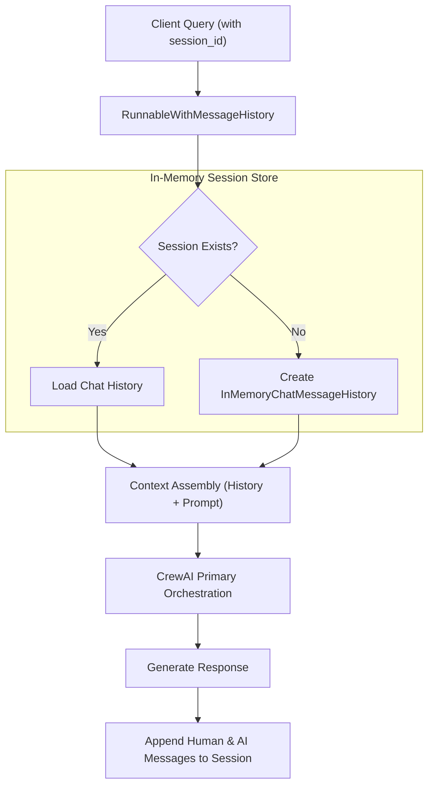

# Conversational Memory & Session State Specification

## Naukri.com Domain Support Agent (HR & Recruitment Track)

---

## 1. Memory Architecture & Technical Stack

The **Naukri.com Domain Support Agent** implements conversational session memory to maintain context across multi-turn interactions. This allows recruiters to ask follow-up questions, resolve candidate references (pronouns), and maintain conversational flow without re-submitting application IDs or policy contexts.

### Technical Components

- **Framework:** LangChain Core memory abstraction.
- **Backing Store:** `InMemoryChatMessageHistory` (ephemeral per-session dictionary).
- **Execution Wrapper:** `RunnableWithMessageHistory`.
- **Partition Key:** Unique `session_id` (UUIDv4 string passed in request headers or body).



---

## 2. Session Lifecycle & State Isolation

### 2.1 Session Initialization & Retrieval

- Each request to `/ask` or connection frame to `/ws/chat` accepts an optional `session_id`.
- If omitted, the gateway generates a fresh UUIDv4 identifier:

  ```python
  session_id = request.session_id or str(uuid.uuid4())
  ```

- The memory manager indexes histories in a thread-safe dictionary:

  ```python
  session_store: Dict[str, InMemoryChatMessageHistory] = {}

  def get_session_history(session_id: str) -> InMemoryChatMessageHistory:
      if session_id not in session_store:
          session_store[session_id] = InMemoryChatMessageHistory()
      return session_store[session_id]
  ```

### 2.2 Cross-Session Memory Isolation

- In accordance with privacy and security requirements, conversations across distinct `session_id` keys maintain complete isolation.
- Conversation turns in Session A (e.g. querying a candidate's sensitive salary) are completely inaccessible to Session B.
- Verified through two independent transcripts:
  - **Transcript 1:** Multi-turn session demonstrating context retention.
  - **Transcript 2:** Separate fresh session demonstrating zero context leakage.

---

## 3. Conversational Anaphora & Context Resolution

Recruiters frequently ask abbreviated follow-up queries that require historical context resolution.

### Multi-Turn Dialogue Scenarios

#### Scenario A: Applicant Status Follow-Up

- **Turn 1 (User):** `"Please check the status of candidate application APP-00012."`
  - *Agent:* Retrieves status from `JOB_APPLICATIONS`, returns role (Software Engineer), status (Offered), and expected salary (₹18,00,000).
- **Turn 2 (User):** `"Are they flagged for priority review and what is their escalation score?"`
  - *Context Resolution:* `ResponseComposer` inspects history, resolves `"they"` and `"their"` to `APP-00012`, extracts prior tool execution metadata, and answers without prompting for the record ID again.

#### Scenario B: Policy Clarification Follow-Up

- **Turn 1 (User):** `"What is the standard notice period for Software Engineers?"`
  - *Agent:* Answers 60 days based on `05_notice_period.md`.
- **Turn 2 (User):** `"Can the business unit head waive it or approve a buyout?"`
  - *Context Resolution:* `ResponseComposer` recognizes the subject is still notice period and synthesizes buyout approval criteria.

---

## 4. Context Pruning & Token Budget Management

To respect the runtime per-request budget cap of 250 prompt tokens, session memory includes a sliding window pruning mechanism:

- **Max History Depth:** Retains the last 4 conversational turns (2 human queries + 2 assistant responses).
- **Trimming Strategy:**
  - Old turns beyond the sliding window are pruned from the active prompt context.
  - The initial system instructions and retrieved vector context take precedence over historical conversation turns.

```python
def prune_history_to_budget(history_messages: List[BaseMessage], max_tokens: int = 150) -> List[BaseMessage]:
    # Retains most recent messages fitting within the context allowance
    pruned = []
    accumulated_chars = 0
    for message in reversed(history_messages):
        msg_chars = len(message.content)
        if (accumulated_chars + msg_chars) / 4 > max_tokens:
            break
        pruned.insert(0, message)
        accumulated_chars += msg_chars
    return pruned
```

---

## 5. Ecosystem Compatibility & Deprecation Handling

### LangChain Deprecation Warning Invariant

- Modern LangChain releases emit `LangChainDeprecationWarning` when referencing `RunnableWithMessageHistory`:

  ```text
  LangChainDeprecationWarning: The class `RunnableWithMessageHistory` was deprecated in LangChain 0.3.0 and will be removed in 1.0.0.
  ```

- **Constraint Handling (Constraint #9):**
  - This warning is explicitly acknowledged and documented as an expected ecosystem message.
  - In accordance with problem specifications, warning filters will **not** silence this message.

---

## 6. Verification & Transcript Artifacts

The session memory implementation is validated through automated test scripts emitting verification artifacts:

- **`transcripts/t8_memory_sessions.txt`**:
  - *Section 1:* Two-turn sequence showing pronoun resolution and state carryover.
  - *Section 2:* Fresh session showing clean state and absence of prior conversational variables.
